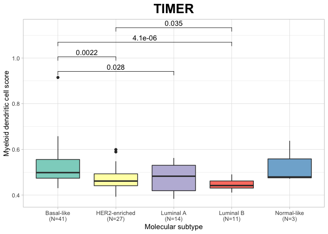
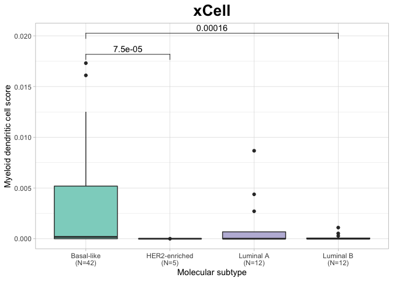

Cell-type Deconvolution Graphs
================

### Deconvolution results by cell-type

#### T cells

##### Nigerian

##### TCGA

#### CD8+ T cells

##### Nigerian

##### TCGA

#### CD4+ T cells

##### Nigerian

##### TCGA

#### B cells

##### Nigerian

##### TCGA

#### NK cells

##### Nigerian

##### TCGA

#### Neutrophils

##### Nigerian

##### TCGA

#### Macrophages

##### Nigerian

##### TCGA

#### Myeloid dendritic cells

##### Nigerian

##### TCGA

