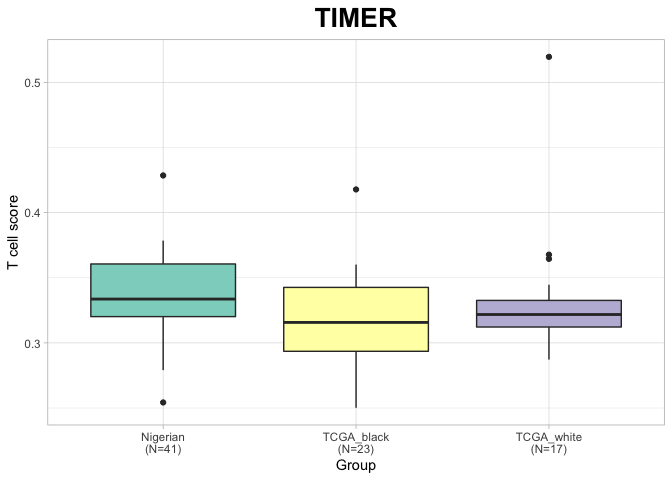
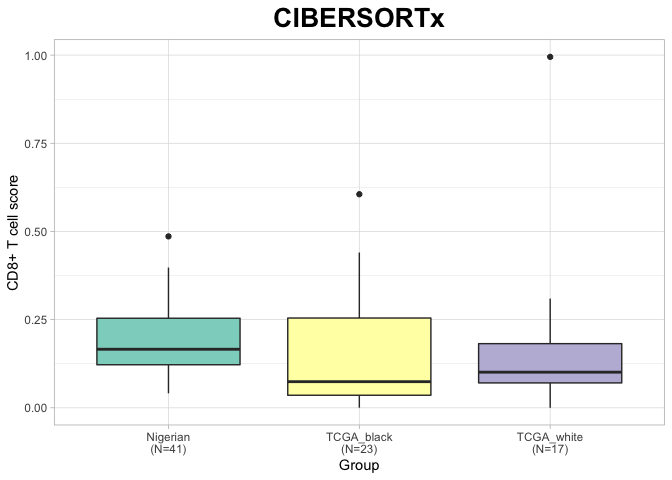
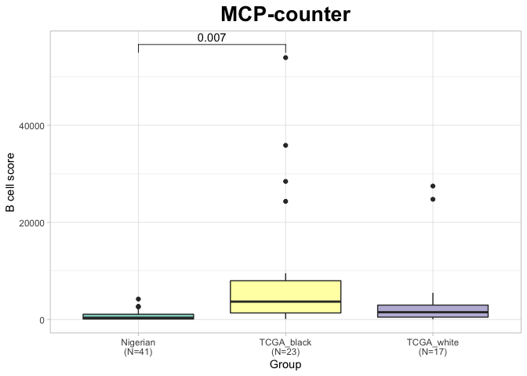
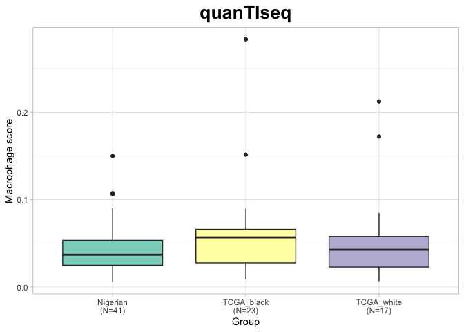

Cell-type Deconvolution Graphs
================

### Deconvolution results by cell-type

#### T cells

#### CD8+ T cells

#### CD4+ T cells

#### B cells

#### NK cells

#### Neutrophils

#### Macrophages

#### Myeloid dendritic cells

